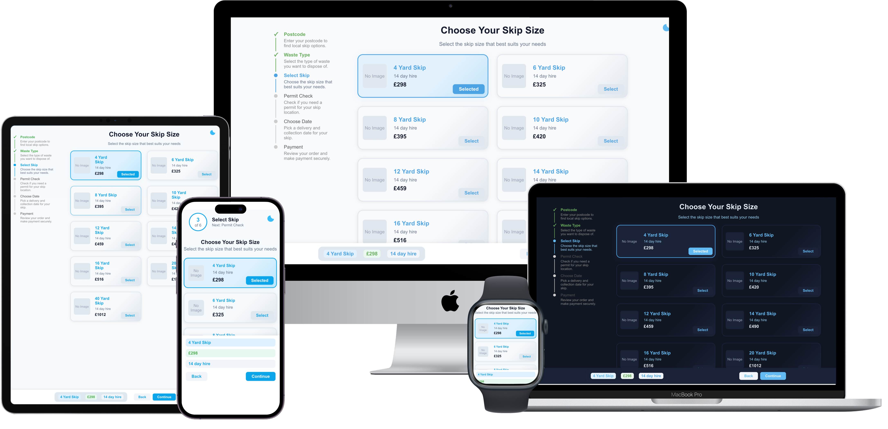

# Code Challenge | Developed By Daniel Dabiri | Skip Selector App


A modern, responsive React application for selecting skip sizes, designed with best practices for maintainability, scalability, and user experience.

## Table of Contents
- [Overview](#overview)
- [Screenshots](#screenshots)
- [Features](#features)
- [Dark Mode](#dark-mode)
- [Project Structure](#project-structure)
- [Styling Approach](#styling-approach)
- [Responsiveness](#responsiveness)
- [API Integration](#api-integration)
- [Setup & Development](#setup--development)
- [Extensibility](#extensibility)
- [Accessibility](#accessibility)
- [License](#license)

---

## Overview
This project implements a skip size selection page, fetching real-time data from a remote API and presenting it in a user-friendly, mobile-first interface. The design and codebase are structured to meet senior-level engineering standards, with a focus on:
- Clean, modular React components
- Professional, maintainable CSS
- Accessibility and responsiveness
- Clear separation of concerns

## Screenshot



> _The screenshot above is mockup of the UI for both desktop and mobile._

## Features
- **Dynamic skip options:** Fetched from a live API and mapped to a consistent UI model
- **Modern UI/UX:** Card-based layout, clear progress stepper, sticky summary bar
- **Mobile-first design:** Optimized for all device sizes
- **Single source of truth for styles:** All styling is managed in a well-organized `App.css`
- **Component-based architecture:** Each UI element is a reusable React component
- **Dark mode:** Instantly switch between light and blueish dark mode with a floating SVG toggle button

## Dark Mode
- **Toggle:** A floating SVG button (moon/sun) in the top-right corner lets users switch between light and dark mode at any time.
- **Blueish palette:** The dark mode uses a blueish color scheme for a modern, accessible look.
- **CSS variables:** All colors are managed with CSS variables, so the theme updates instantly and smoothly.
- **Persistence:** User preference is saved in `localStorage` and respects system preference on first load.
- **Accessible:** The toggle button is keyboard and screen-reader accessible.

## Project Structure
```
src/
  api/           # API utilities (fetching skip data)
  components/    # All React components (Stepper, SkipCard, SummaryBar, DarkModeToggle)
  types/         # TypeScript types (e.g., SkipOption, SummaryBarProps, StepperProps)
  App.tsx        # Main app logic and layout
  App.css        # All global and component styles
  index.tsx      # App entry point
```

- **Components** are organized by feature and imported into `App.tsx`.
- **Types** are centralized for consistency and type safety.
- **API logic** is abstracted for easy maintenance and testing.

## Styling Approach
- **Single CSS file (`App.css`):**
  - All styles are grouped by component for clarity (Stepper, SkipCard, SummaryBar, etc.)
  - Uses CSS custom properties (`:root`) for theming and easy color changes
  - Responsive breakpoints for mobile, tablet, and desktop
  - Utility classes for loading/error states
  - **Dark mode:** Uses a `.dark` class on `<body>` and CSS variables for instant theme switching
- **No CSS modules:** All styles are global for simplicity and easy overrides.

## Responsiveness
- **Mobile (≤600px):** 1 card per line, vertical stacking, touch-friendly
- **Tablet (601px–899px):** Horizontal scrollable card list
- **Desktop (≥900px):** 2 cards per row using CSS grid
- **Sticky summary bar:** Always visible at the bottom for quick access

## API Integration
- Fetches skip options from:
  `https://app.wewantwaste.co.uk/api/skips/by-location?postcode=NR32&area=Lowestoft`
- Maps API data to a consistent internal model for display
- Handles loading and error states gracefully

## Setup & Development
1. **Install dependencies:**
   ```sh
   npm install
   ```
2. **Start the development server:**
   ```sh
   npm start
   ```
3. **Build for production:**
   ```sh
   npm run build
   ```

## Extensibility
- **Add new skip features:** Extend the `SkipOption` type and update the card UI as needed
- **Add more steps:** Update the `steps` array in `App.tsx` and the Stepper component
- **Switch to CSS modules:** If you want stricter style encapsulation, you can modularize styles per component
- **Testing:** Add unit/integration tests using Jest and React Testing Library for each component

## Accessibility
- All interactive elements use semantic HTML and ARIA attributes
- Keyboard navigation and focus states are supported
- Color contrast and font sizes are chosen for readability
- Dark mode toggle is accessible

## License
This project is open source and available under the [MIT License](LICENSE). 